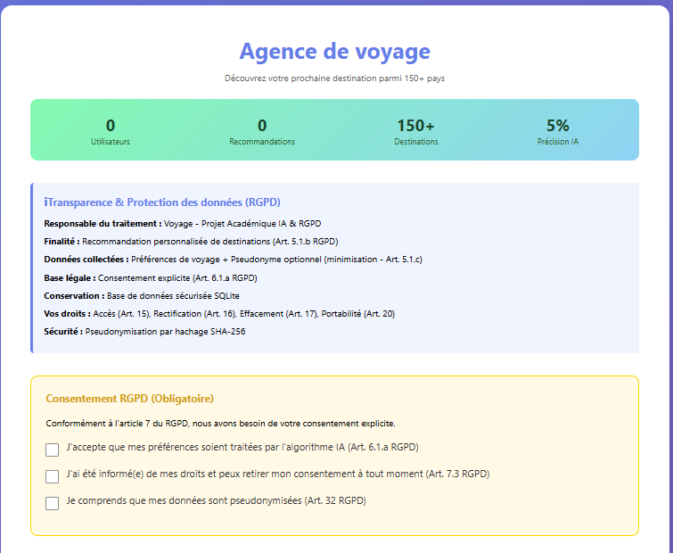

# 🔒 VoyageIA : recommandation de voyages conforme au RGPD

> Projet de Master Data & IA, Nexa Digital School.
> Une application web qui recommande une destination de voyage grâce à l'IA, **conçue dès le départ pour respecter le RGPD** (Privacy by Design).

## L'idée

La plupart des projets d'IA traitent le RGPD comme une case à cocher à la fin. Ici, chaque exigence est **codée dans l'application** : le consentement est enregistré comme preuve, les données sont pseudonymisées, et l'utilisateur peut consulter, récupérer ou effacer ses données en un clic.

## Aperçu

| Information et consentement | Préférences et exercice des droits |
|---|---|
|  |  |

## Fonctionnalités

**Côté utilisateur**
- Choix de ses préférences : budget, climat, type d'activité, durée, continent.
- Recommandation d'une destination parmi **111 villes**, avec un score de confiance.
- Interface accessible : balisage pour les lecteurs d'écran, taille du texte réglable et **mode contraste élevé**.

**Côté conformité**

| Exigence RGPD | Mise en œuvre dans le code |
|---|---|
| Information (art. 13) | Panneau qui présente le responsable, la finalité, la base légale et les droits |
| Consentement explicite (art. 7) | Trois cases à cocher obligatoires : le formulaire reste bloqué sans elles |
| Preuve du consentement (art. 7.1) | Chaque consentement est enregistré avec sa date dans la table `consents` |
| Minimisation (art. 5) | Pseudonyme facultatif, seules les données utiles sont collectées |
| Pseudonymisation (art. 32) | Identifiant de l'utilisateur et adresse IP hachés en SHA-256 : l'adresse IP n'est jamais stockée en clair |
| Droit d'accès (art. 15) | Route `/rgpd/data-request` : l'utilisateur consulte toutes ses données |
| Droit à la portabilité (art. 20) | Restitution de toutes ses données dans un format structuré et réutilisable (JSON) |
| Droit à l'effacement (art. 17) | Route `/rgpd/data-deletion` : suppression définitive de toutes ses données |
| Traçabilité | Journal d'audit `rgpd_logs` : chaque action sur les données est enregistrée |

## Architecture

```
Navigateur (HTML / CSS / JavaScript)
        │
        ▼
Application Flask (app.py)
   ├── Modèle de recommandation : arbre de décision (scikit-learn)
   └── Base SQLite (voyageia.db), 5 tables :
         users · consents · preferences · recommendations · rgpd_logs
```

## Structure du dépôt

```
├── app.py                          # application Flask : routes, modèle, fonctions RGPD
├── templates/
│   └── index.html                  # interface : formulaire, consentement, droits
├── Database/
│   └── travel_destinations.csv     # 111 destinations : ville, pays, catégories, meilleure période
├── captures/                       # aperçu de l'application
└── requirements.txt
```

La base `voyageia.db` n'est **volontairement pas publiée** : même pseudonymisées, des données d'utilisateurs n'ont rien à faire dans un dépôt public. Elle est recréée automatiquement au premier lancement.

## Lancer le projet

```bash
pip install -r requirements.txt
python app.py
```

Puis ouvrir http://127.0.0.1:5000 dans un navigateur.

## Limites et pistes d'amélioration

J'ai choisi de documenter honnêtement les limites de ce prototype :

- **Données d'entraînement en partie simulées, et une précision faible** : le fichier de destinations contient la ville, le pays et les catégories d'activités, mais le budget, le climat et la durée sont générés aléatoirement selon le continent. Résultat : le modèle obtient **5 % de précision** en test pour 111 destinations possibles. Il ne peut pas apprendre de vraie relation à partir d'attributs tirés au hasard. Ce prototype démontre donc l'**architecture RGPD**, pas la qualité de la recommandation. Pour une vraie application, il faudrait des données réelles (coût de la vie, météo) et une approche par similarité plutôt qu'une classification sur 111 classes.
- **Pseudonymisation renforçable** : le pseudonyme saisi est encore conservé dans la table `users`. Il suffirait de ne stocker que son empreinte, et d'ajouter un « sel » secret au hachage pour empêcher de retrouver un pseudonyme en le devinant.
- **Portabilité** : les données sont affichées au format JSON ; un bouton de téléchargement direct du fichier serait plus pratique.
- **Droit de rectification (art. 16)** : il est mentionné dans l'information, mais pas encore implémenté.
- **Mode debug** : `app.run(debug=True)` est pratique en développement, mais il faut le désactiver avant toute mise en ligne.

## Stack

Python · Flask · SQLite · scikit-learn · pandas · HTML / CSS / JavaScript

---

👩‍💻 **Nosaiba Elkrekshi** · 

Master 2 Data & IA · 

[LinkedIn](https://www.linkedin.com/in/nosaiba-elkrekshi) · 

nosaiba.elkrekshi@gmail.com
